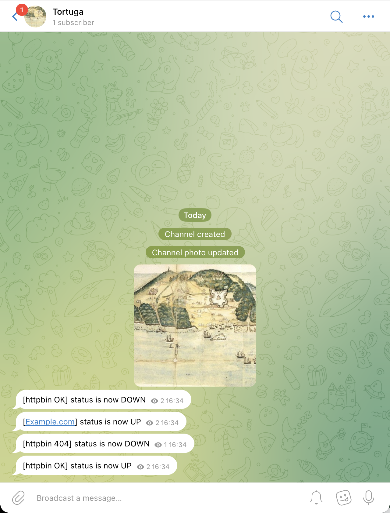

# Tortuga 🏴‍☠️

> *"Make way for Tortuga!"*
> — Captain Barbossa

🛠️ **Project Origin**: This project originally began as a highly successful AI-assisted engineering experiment designed to build a lightweight, specialized tool for personal development workflows.

**A blazingly fast, terminal-based HTTP endpoint monitor** that watches your services in real-time, fires instant alerts the moment anything goes down, and never loses state.

Tortuga renders a **live TUI dashboard** refreshed every second, sends push notifications via **Telegram** and Slack/Discord webhooks, and persists uptime metrics across restarts—all from a single binary.

---

## Dashboard

```bash
┌─────────────────────────────── Tortuga ────────────────────────────────┐
│ Name            URL                            Status  HTTP  Uptime  ms │
│ httpbin OK      https://httpbin.org/status/200 UP      200   100%    87 │
│ httpbin 404     https://httpbin.org/status/404 DOWN    404    0%    102 │
│ Example.com     https://example.com            UP      200    99%   210 │
├─────────────────────────────── Events ─────────────────────────────────┤
│ 16:34:01  [httpbin OK] Unknown → UP (HTTP 200)                          │
│ 16:34:02  [httpbin 404] Unknown → DOWN (HTTP 404)                       │
└────────────────────────────────────────────────────────────────────────┘
```

**Green** = UP · **Red** = DOWN · **Yellow** = Unknown / timeout

## Features

- **Live TUI Dashboard** — Real-time ratatui terminal UI refreshed every second with status, HTTP code, uptime %, response time, and last-check timestamp
- **Concurrent, Async Monitoring** — Each endpoint runs in its own Tokio task with independent polling intervals and timeouts; zero blocking
- **Telegram Alerts** — Instant push notifications via Telegram Bot API to any channel or group
- **Webhook Alerts** — Slack-compatible JSON POST (also works with Discord, custom webhooks)
- **Persistent Uptime Metrics** — Uptime counters and status history survive restarts via local `state.json`
- **Graceful Shutdown** — Press `q` or `Ctrl-C`; state is flushed to disk automatically

## Telegram Alerts



Alerts are pushed to a Telegram channel or chat the moment an endpoint changes status.

### Setting up Telegram

1. **Create a bot** — open [@BotFather](https://t.me/BotFather) on Telegram, send `/newbot`, and copy the token it gives you.
2. **Find your chat ID**
   - For a **public channel**: use `@yourchannel` as the chat ID.
   - For a **private channel / group**: add the bot as an admin, then call `https://api.telegram.org/bot<token>/getUpdates` — the `"chat"."id"` field in the response is your chat ID (negative number for channels, e.g. `-1001234567890`).
3. Add the values to `config.toml` (see configuration below).

## Installation

**Prerequisites:** Rust 1.80+ and Cargo ([rustup.rs](https://rustup.rs))

```bash
git clone https://github.com/gianlucarea/tortuga
cd tortuga
cargo build --release
./target/release/tortuga
```

That's it. Tortuga reads `config.toml` from the current directory by default.

## Technical Blueprint

**Why Rust?** Tortuga handles dozens of endpoints concurrently without consuming heavy resources. Rust's async runtime (Tokio) guarantees memory safety and zero-cost abstractions — critical for a long-running monitoring daemon.

**Why Tokio + Ratatui?**

- **Tokio** handles all HTTP polling concurrently; each endpoint runs in its own task with independent scheduling. No thread spawn overhead.
- **Ratatui** provides a snappy, responsive terminal UI without terminal flicker. Custom render loop refreshes at 1Hz for smooth state transitions.

**Architecture:**

- **`main.rs`** — CLI orchestration, signal handling (`SIGINT`/`SIGTERM`), graceful shutdown
- **`config.rs`** — Strongly-typed TOML deserialization with serde; per-endpoint and global config cascading
- **`monitor.rs`** — Async polling engine; each endpoint is a spawned task that sleeps between polls and updates shared state
- **`state.rs`** — Atomic reference-counted `SharedState` for lock-free reads; uptime is computed on-the-fly; JSON persistence is append-safe
- **`alert.rs`** — Telegram + webhook delivery; retry logic for transient failures
- **`ui.rs`** — Single-threaded ratatui render loop; reads shared state and paints the dashboard

**Key Decisions:**

- **JSON state over SQLite** — Simpler, zero dependencies, append-only writes prevent corruption during crashes
- **Per-endpoint tasks over a thread pool** — Tokio's work-stealing scheduler is more efficient than manual thread management
- **Graceful shutdown** — Signal handlers trigger a clean flush of state before exit; no data loss

## Configuration

Create (or edit) `config.toml` next to the binary:

```toml
[global]
state_file = "state.json"           # path to persist uptime state

# --- Telegram (optional) ---
telegram_bot_token = "123456:ABC-DEF..."   # from @BotFather
telegram_chat_id   = "@mychannel"          # public: "@chan" | private: "-1001234567890"

# --- Webhook / Slack / Discord (optional) ---
# webhook_url = "https://hooks.slack.com/services/YOUR/WEBHOOK/URL"

[[endpoints]]
name            = "My API"
url             = "https://api.example.com/health"
interval_secs   = 30
expected_status = 200      # optional — omit to treat any 2xx as UP
timeout_secs    = 10       # optional, default 10

# Per-endpoint overrides (both optional):
# webhook_url      = "https://..."
# telegram_chat_id = "-1009876543210"

[[endpoints]]
name          = "Example.com"
url           = "https://example.com"
interval_secs = 60
timeout_secs  = 15
```

### Configuration reference

| Key | Scope | Description |
|-----|-------|-------------|
| `state_file` | global | Path to the JSON file used for state persistence |
| `telegram_bot_token` | global | Telegram bot token from @BotFather |
| `telegram_chat_id` | global / endpoint | Target channel or chat (endpoint value overrides global) |
| `webhook_url` | global / endpoint | Slack-compatible webhook URL (endpoint value overrides global) |
| `name` | endpoint | Display name in the dashboard |
| `url` | endpoint | URL to poll |
| `interval_secs` | endpoint | Polling interval in seconds |
| `expected_status` | endpoint | Exact HTTP status for UP; omit for any 2xx |
| `timeout_secs` | endpoint | Request timeout in seconds (default: 10) |

## Usage

```bash
# Default: reads config.toml from current directory
./tortuga

# Custom config file
./tortuga --config /etc/tortuga/prod.toml
```

**Keyboard shortcuts:**

- Press **`q`** or **`Ctrl-C`** to exit cleanly (state is saved automatically)

---

## License

[MIT](LICENSE)
